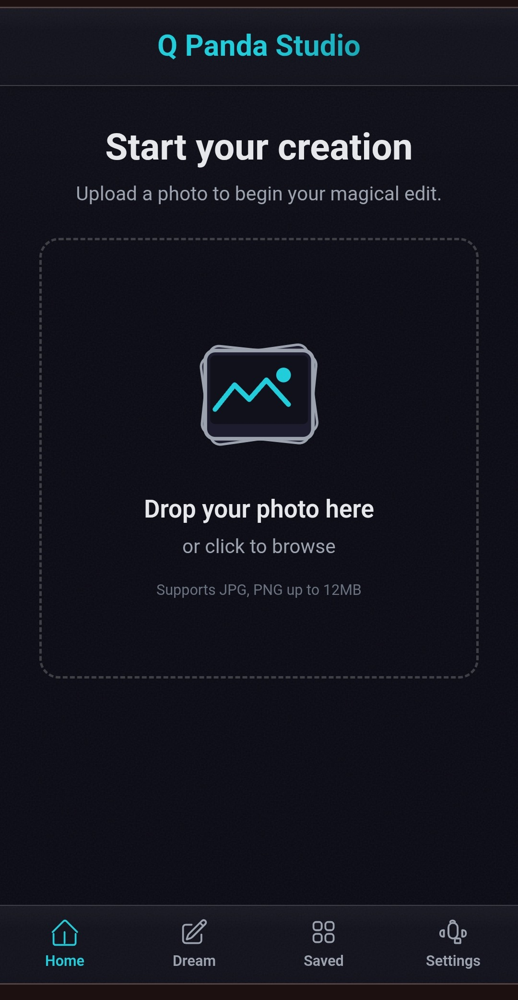
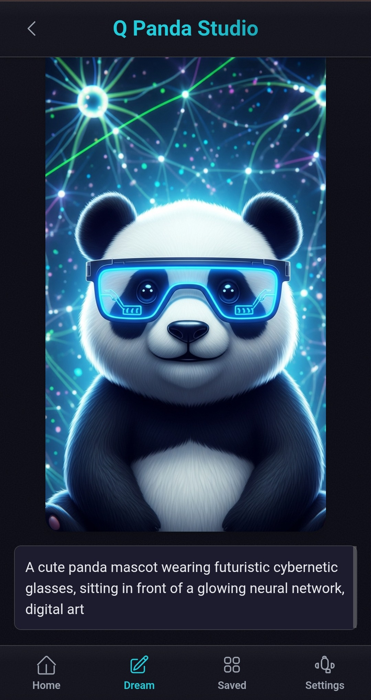
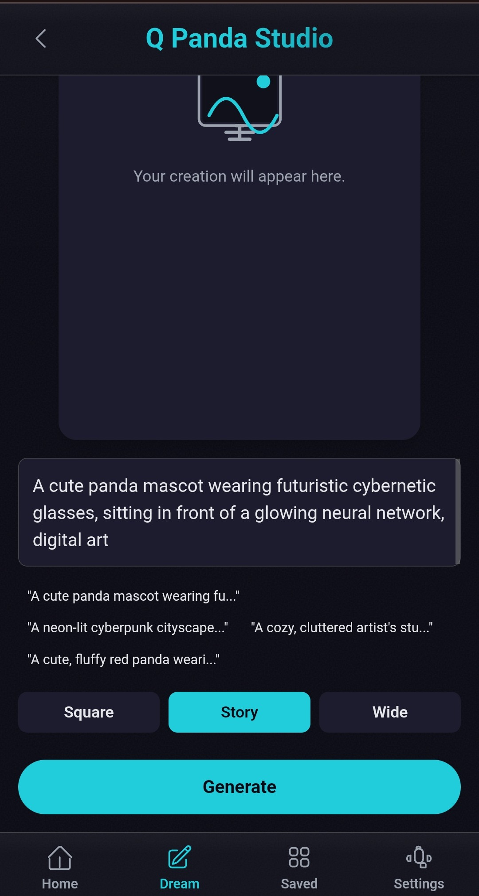
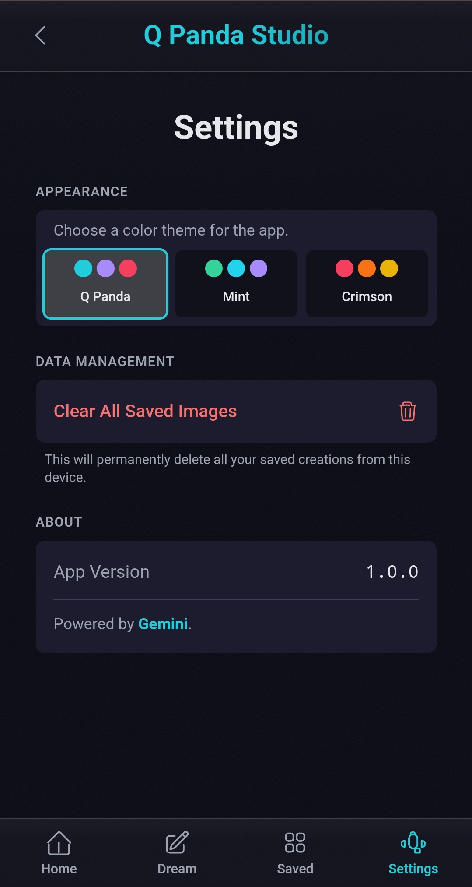

<div align="center">
  <h1>🐼🍌 PandaBanana</h1>
  <p><strong>AI-Powered Creative Photo Studio</strong></p>
  
  
  
  <p>
    
    
  </p>
  
  <p>
    
    
    
    
  </p>
</div>

---

## 📱 See It In Action

<div align="center">
  
  ### Home Screen
  
  
  ### AI Generation
  
  
  ### Prompt Editor
  
  
  ### Settings
  
  
</div>

---

## ✨ What is PandaBanana?

**PandaBanana** is a revolutionary AI-powered photo editing platform that transforms your images into creative masterpieces. Powered by Google's Gemini AI, it offers multiple creative tools to enhance, transform, and reimagine your photos with just a few clicks.

### 🎯 Key Features

#### Core Editors
- **🌟 Scene Shift**: Teleport your images to entirely new environments and settings
- **😂 Meme Smith**: Generate hilarious memes with AI-powered text and effects  
- **🎭 Clone Cast**: Create stunning variations and artistic interpretations
- **🎨 Dream Canvas**: Generate original artwork from your imagination

#### Advanced Tools
- **✂️ Smart Crop**: AI-powered intelligent cropping for perfect compositions across different aspect ratios
- **🎨 Style Transfer**: Transform photos into artistic masterpieces (Van Gogh, Picasso, Monet, Anime, and more)
- **⬆️ Image Upscaler**: Enhance resolution and quality with AI-powered upscaling
- **🎬 GIF Creator**: Generate animated sequences with AI-driven frame variations

#### Platform Features
- **📱 Mobile-First Design**: Responsive interface optimized for all devices
- **🎭 Multiple Themes**: Customizable UI themes for personalized experience
- **💾 Local Storage**: Save and manage your creations locally
- **⚡ Real-time Processing**: Fast AI-powered image generation
- **🔒 Rate Limiting**: Built-in API rate limiting with IP whitelisting support
- **🛡️ Security**: Server-side API key management for enhanced security

---

## 🚀 Quick Start

### Prerequisites
- **Node.js** (version 16 or higher)
- **Gemini API Key** from [Google AI Studio](https://makersuite.google.com/app/apikey)

### Installation

1. **Clone the repository**
   ```bash
   git clone git@github.com:harryneopotter/PandaBanana.git
   cd q-panda-studio
   ```

2. **Install dependencies**
   ```bash
   npm install
   ```

3. **Set up environment variables**
   ```bash
   # Copy the example environment file
   cp .env.example .env.local
   
   # Edit .env.local and add your Gemini API key
   # GEMINI_API_KEY=your_gemini_api_key_here
   ```
   
   > 🔑 Get your API key from [Google AI Studio](https://makersuite.google.com/app/apikey)

4. **Start the application**
   
   **Option A: Full stack (for local development)**
   ```bash
   npm run dev:full
   ```
   This starts both the frontend (port 5173) and Express API server (port 3001) with rate limiting.
   
   **Option B: Frontend only (direct Gemini API)**
   ```bash
   npm run dev
   ```
   Set `VITE_USE_API_PROXY=false` to call Gemini API directly from the browser.

5. **Open your browser**
   - Navigate to `http://localhost:5173`
   - Start creating amazing images! 🎨

6. **Configure Rate Limiting (Optional)**
   - See [RATE_LIMITING.md](./RATE_LIMITING.md) for detailed configuration
   - Set request limits, time windows, and IP whitelisting
   - Default: 10 requests per 15 minutes per IP

---

## 🎮 How to Use

### 1. **Upload Your Image**
   - Click the upload area or drag & drop your image
   - Supported formats: JPG, PNG, GIF, WebP
   - Max size: 10MB

### 2. **Choose Your Creative Tool**
   - **Scene Shift**: Transform backgrounds and environments
   - **Meme Smith**: Add text and meme effects
   - **Clone Cast**: Create artistic variations
   - **Dream Canvas**: Generate from scratch
   - **Smart Crop**: AI-powered cropping for different aspect ratios
   - **Style Transfer**: Apply artistic styles (Van Gogh, Anime, etc.)
   - **Upscale**: Enhance image quality and resolution
   - **GIF Creator**: Generate animated frame sequences

### 3. **Customize & Create**
   - Select from preset options or enter custom prompts
   - Watch as AI transforms your image in real-time
   - Use undo/redo to perfect your creation

### 4. **Save & Share**
   - Save your creations to local storage
   - Download high-quality results
   - Share your masterpieces!

---

## 🏗️ Tech Stack

- **Frontend Framework**: React 19.1.1 with TypeScript
- **Build Tool**: Vite 6.2.0 for lightning-fast development
- **AI Engine**: Google Gemini AI for image processing
- **Styling**: Custom CSS with theme system
- **State Management**: React Hooks
- **Storage**: Browser localStorage for saved images

---

## 📱 Features Deep Dive

### 🌟 Scene Shift Editor
Transform your photos into different environments:
- Beach paradises, mountain landscapes, urban scenes
- Historical settings, fantasy worlds, space environments
- Custom scene descriptions supported

### 😂 Meme Smith
Create viral-ready memes:
- AI-generated meme text and captions
- Popular meme formats and templates
- Custom font and positioning

### 🎭 Clone Cast
Artistic image variations:
- Create multiple variations of your image
- Style transfers and artistic interpretations
- Explore creative possibilities

### 🎨 Dream Canvas
Generate original artwork:
- Text-to-image generation from imagination
- Creative prompts and artistic styles
- High-resolution AI-generated outputs

### ✂️ Smart Crop
AI-powered intelligent cropping:
- Perfect compositions for any aspect ratio
- 5 preset ratios: Square (1:1), Landscape (16:9), Portrait (9:16), Classic (4:3), Ultrawide (21:9)
- AI analyzes subject and suggests optimal crop
- Preserves important elements automatically

### 🎨 Style Transfer
Transform photos into artistic masterpieces:
- **10 Artistic Styles**: Van Gogh, Picasso, Monet, Warhol, Hokusai, Anime, Watercolor, Oil Painting, Sketch, Cyberpunk
- Apply famous painting styles to your photos
- Real-time style preview
- High-quality artistic transformations

### ⬆️ Image Upscaler
Enhance image quality and resolution:
- AI-powered upscaling for sharper details
- Quality enhancement and noise reduction
- Before/after comparison view
- Perfect for improving low-resolution images

### 🎬 GIF Creator
Generate animated sequences:
- **5 Animation Presets**: Color Shift, Weather Changes, Time of Day, Artistic Styles, Zoom Effects
- Custom animation prompts supported
- Multi-frame generation (up to 10 frames)
- Individual frame editing and management
- Export-ready frame sequences

---

## 🛠️ Development

### Available Scripts

```bash
# Start development server
npm run dev

# Build for production
npm run build

# Preview production build
npm run preview
```

### Project Structure
```
q-panda-studio/
├── src/
│   ├── components/          # React components
│   │   ├── ImageUploader.tsx
│   │   ├── SceneShiftEditor.tsx
│   │   ├── MemeSmithEditor.tsx
│   │   └── ...
│   ├── services/           # API services
│   │   └── geminiService.ts
│   ├── types.ts           # TypeScript definitions
│   ├── themes.ts          # UI themes
│   └── constants.ts       # App constants
├── public/                # Static assets
└── package.json          # Dependencies
```

---

## 🔒 Rate Limiting & Security

PandaBanana includes built-in rate limiting and IP whitelisting to protect your API usage:

### Features
- **Per-IP Rate Limiting**: Prevents abuse by limiting requests per IP address
- **IP Whitelisting**: Bypass rate limits for trusted IPs
- **Configurable Limits**: Customize time windows and request counts
- **Secure API Keys**: Server-side API key management

### Quick Configuration

Edit `.env.local`:
```env
# Rate limiting (10 requests per 15 minutes by default)
RATE_LIMIT_WINDOW_MS=900000
RATE_LIMIT_MAX_REQUESTS=10

# Whitelist your development IPs (comma-separated)
WHITELISTED_IPS=127.0.0.1,192.168.1.100
```

📖 **Full Documentation**: See [RATE_LIMITING.md](./RATE_LIMITING.md) for complete setup guide

---

## 🎨 Themes

PandaBanana comes with multiple beautiful themes:
- **Q Panda** (Default): Vibrant and modern
- **Mint**: Fresh green aesthetic
- **Crimson**: Bold red accents

---

## 🚀 Deployment

PandaBanana supports multiple deployment options:

### ☁️ Serverless (Vercel/Netlify) - **Recommended for Free Tier**
- ✅ **Free hosting** on Vercel or Netlify
- ✅ Serverless functions with rate limiting
- ✅ Auto-scaling and CDN
- ⚠️ Rate limits reset on cold starts (acceptable for most use cases)

**Quick Deploy:**
```bash
# Vercel
vercel

# Netlify  
netlify deploy --prod
```

### 🖥️ Traditional Server (Railway/Render/Fly.io)
- ✅ Persistent rate limiting with Redis
- ✅ Always-on server (no cold starts)
- ✅ Better for high-traffic apps
- 💰 Starts at ~$5-10/month

**Deploy Express server:**
```bash
npm run build:server
npm run start:server
```

📖 **Full Deployment Guide:** See [DEPLOYMENT.md](./DEPLOYMENT.md) for detailed instructions

---

## 🤝 Contributing

We welcome contributions! Here's how you can help:

1. **Fork** the repository
2. **Create** a feature branch (`git checkout -b feature/amazing-feature`)
3. **Commit** your changes (`git commit -m 'Add amazing feature'`)
4. **Push** to the branch (`git push origin feature/amazing-feature`)
5. **Open** a Pull Request

### Development Guidelines
- Follow TypeScript best practices
- Write clean, readable code with proper error handling
- Include JSDoc comments for functions
- Test your changes thoroughly
- Follow existing code patterns and conventions

---

## 📄 License

This project is licensed under the MIT License - see the [LICENSE](LICENSE) file for details.

---

## 🙏 Acknowledgments

- **Google Gemini AI** for powering our image processing
- **React Team** for the amazing framework
- **Vite Team** for the lightning-fast build tool
- **Open Source Community** for inspiration and tools

---

<div align="center">
  <h3>🌟 Star this repo if you found it helpful!</h3>
  <p>Made with ❤️ by the PandaBanana team</p>
  
  <p>
    <a href="https://github.com/harryneopotter/PandaBanana/issues">Report Bug</a> •
    <a href="https://github.com/harryneopotter/PandaBanana/issues">Request Feature</a> •
    <a href="https://github.com/harryneopotter/PandaBanana">⭐ Star on GitHub</a>
  </p>
</div>
